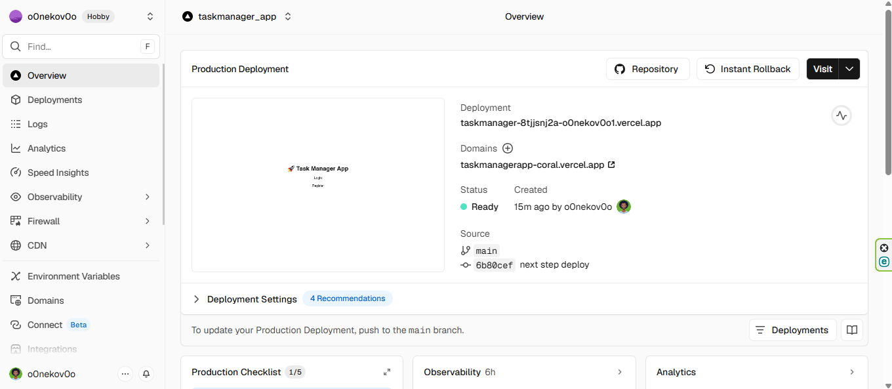

# 🚀 Task Manager SaaS

## 📌 Description
Application fullstack permettant à chaque utilisateur de gérer ses tâches de manière sécurisée.

Chaque utilisateur peut :
- ✅ créer des tâches
- ✅ les marquer comme complétées
- ✅ supprimer ses tâches
- ✅ filtrer l’affichage (toutes / terminées / en cours)

---

## 🎯 Objectif du projet
Ce projet a été développé pour apprendre à construire une application fullstack moderne.

L’objectif était de reproduire une application SaaS simple, en mettant en place :
- une authentification utilisateur
- une base de données
- une gestion complète CRUD
- une interface utilisateur moderne

---

## ⚙️ Stack technique
- **Frontend** : Next.js (TypeScript)
- **Backend** : Supabase (PostgreSQL + Auth)
- **UI** : Tailwind CSS
- **Déploiement** : Vercel

---

## ✨ Fonctionnalités
- 🔐 Authentification (signup / login / logout)
- 📝 CRUD complet des tâches
- 👤 Tâches liées à un utilisateur
- 📊 Dashboard avec statistiques
- 🎛️ Filtrage dynamique (all / done / pending)
- 🎨 Interface moderne et responsive

---

## 🌐 Démo en ligne
👉 https://taskmanagerapp-coral.vercel.app/

---

## 📷 Screenshots

### Dashboard


---

## ⚔️ Challenges rencontrés

- Mise en place de l’authentification avec Supabase
- Gestion de la sécurité avec Row Level Security (RLS)
- Liaison des tâches à l’utilisateur connecté
- Synchronisation des données après refresh
- Organisation du code entre frontend et logique backend

---

## 🚀 Améliorations futures

- Ajout de catégories de tâches
- Drag & drop
- Dark mode 🌙
- Notifications
- Optimisation UX

---

## 🛠️ Installation

```bash
git clone https://github.com/ton-repo/task-manager-app.git
cd task-manager-app
npm install
npm run dev